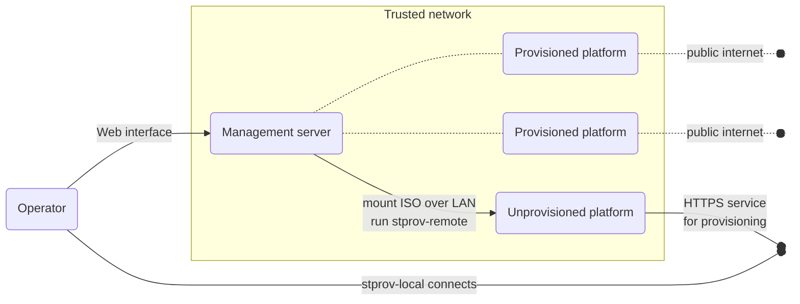
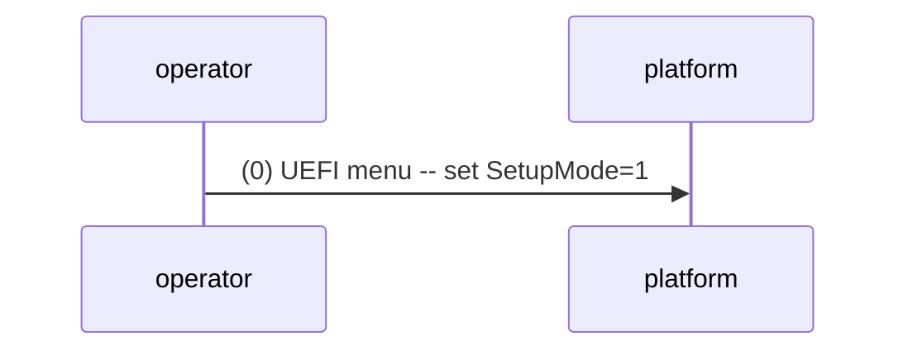
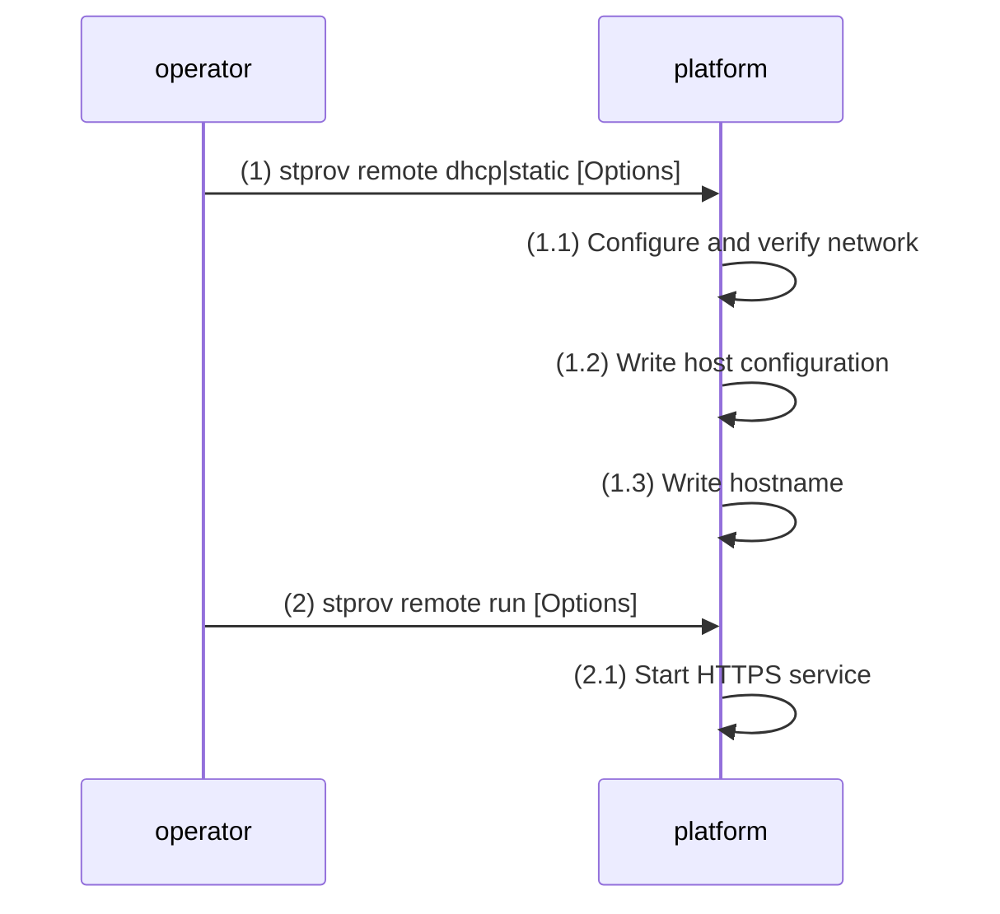
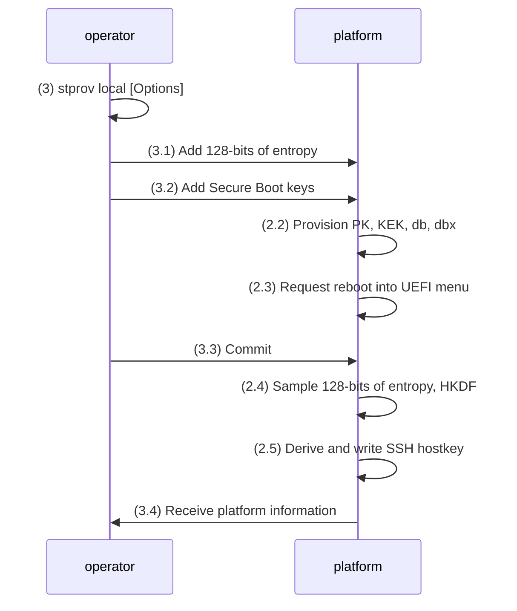
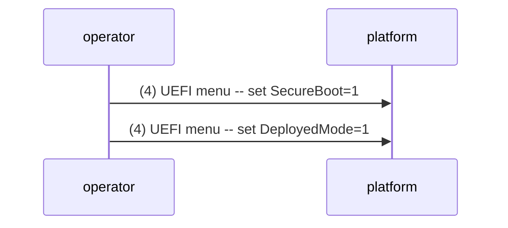

# System documentation for stprov

This document describes a tool for provisioning host-specific configuration to a
System-Transparency booted platform.  Refer to the [stprov manual][] for
detailed usage of the implemented tool.

[stprov manual]: ./stprov-manual.md

## Introduction

stprov is a System Transparency provisioning tool designed to lock down initial
trust in a platform.  The platform to be provisioned is assumed to have a poor
management interface.  For example, it may be a remote web console that does not
support copy-paste.  The platform is further assumed to use the same [stboot][]
image as several other platforms.  In other words, it needs to be provisioned
with its own host-specific configuration to become useful.

The stprov architecture is composed of two parts:

  1. Local: client-side that the operator runs on, e.g., a provisioning laptop.
  2. Remote: server-side that the operator runs on the platform to provision.

As alluded to above, the operator's user interface to the platform is poor.
Therefore, the input and output needed in the remote part is kept to a minimum.
This amounts to configuring the network and setting up a secure channel to the
operator's local system that has reliable input and output.

An example deployment that makes use of stprov is shown below.  The operator
accesses a new platform through a remote management interface that allows
mounting a provisioning ISO.  When booted, the ISO drops into a terminal where
the operator can use the stprov-remote program to configure the network and
start an HTTPS service.  The operator completes the provisioning by connecting to
this service using stprov-local.  After provisioning, the platform's EFI NVRAM
contains custom Secure Boot keys, a host configuration, a hostname, and an SSH
hostkey.  The SSH hostkey can, e.g., be used by an OS package to provide SSH
host authentication.

[stboot]: https://git.glasklar.is/system-transparency/core/stboot/-/blob/v0.5.2/docs/stboot-system.md

## How to make stprov run

The stprov-local program is simple to just run on the operator's own system.

The stprov-remote program is typically embedded in a provisioning ISO, or as an
OS package in stboot's initramfs for use in so-called provisioning mode.  It is
not within the scope of this document to describe creation of these artifacts,
but the reader may find [stimages][] helpful for creating such artifacts.

[stimages]: https://git.glasklar.is/system-transparency/core/stimages

## Provisioned configuration

The following configuration is provisioned by stprov-remote:

  - [Host configuration][]: primarily used by stboot to network-boot an OS
    package.  It can also be used by OS packages to configure their networks.
  - Hostname: an arbitrary hostname that OS packages may use.

The following configuration is provisioned with the help of stprov-local:

  - SSH hostkey: a cryptographic identity that OS packages may use.
  - Secure Boot keys: PK, KEK, db, and optionally dbx.

The SSH hostkey is derived from entropy provided by the operator (local) and the
platform's own entropy (remote).  In more detail, HKDF is used to derive a
unique secret from 128-bits of local and remote entropy.  HKDF is then used
again to derive an SSH hostkey deterministically from that.

The Secure Boot keys are provisioned but *not* generated by stprov.  See the
separate Secure Boot [HOW-TO guides][] for key management and signing.  Note
that stprov will only provision Secure Boot keys that are signed according to
the Secure Boot key hierarchy, and that provisioning only works in Setup Mode.

All configuration is written to EFI NVRAM, see the [EFI variables reference][].

[Host configuration]: https://git.glasklar.is/system-transparency/project/docs/-/blob/v0.4.1/content/docs/reference/host_configuration.md
[HOW-TO guides]: https://git.glasklar.is/system-transparency/project/docs/-/blob/v0.5.0/content/docs/how-to/secure-boot
[EFI variables reference]: https://git.glasklar.is/system-transparency/project/docs/-/blob/v0.4.1/content/docs/reference/efi-variables.md

## Provisioning flow

The operator first gains access to the platform's remote console with an
appropriate provisioning ISO mounted, see the setting that is used as a starting
point in the introduction.

---

The operator started by entering the UEFI menu to enable Secure Boot Setup Mode.
This initial step is optional and only makes sense for Secure Boot provisioning.

---

Breakdown of what happened above:

First, a static or a dynamic network configuration is applied with stprov-remote
based on relevant options like IP address, default gateway, and hostname.  If
configuration succeeds, a host configuration and hostname is committed to EFI
NVRAM.  Provisioning optionally ends here if the SSH hostkey is not essential,
or if the operator is not looking to provision any Secure Boot keys.

Second, the stprov-remote program is used again to start an HTTPS server that
awaits further input from stprov-local.  Important options here include a
one-time password used to establish a mutually authenticated HTTPS session, as
well as an enumeration of allowed networks that the operator can connect from.

At this point the operator can start using their local console for continued
provisioning.  In other words, the below interactions take place over HTTPS
rather than the platform's built-in or remotely-accessible console.

---

As shown above, stprov-local contributes entropy that stprov-remote mixes into
its key derivations.  In other words, both local and remote entropy is used.

As also shown above, stprov-local provides Secure Boot keys that stprov-remote
provisions.  On Secure Boot provisioning (successful or not), the default
behavior is to request that the next reboot goes straight into the UEFI menu.

At the end, platform information is sent from stprov remote to stprov local.
This notably includes the SSH hostkey fingerprint.

---

The operator finally reboots the machine, entering the UEFI menu to enable
Secure Boot and Deployed Mode (if such a toggle is available).

## Client-server API

The exchanges between stprov-local and stprov-remote take place using an HTTP
API.  It is not in scope of this document's revision to describe it in detail.
The short summary would be that stprov-remote has HTTP endpoints that accept
JSON key-value pairs.  Output is also encoded as JSON key-value pairs (if any).

Interested readers can find more details in the [stprov API package][].

[stprov API package]: https://git.glasklar.is/system-transparency/core/stprov/-/blob/main/internal/api/api.go?ref_type=heads

## Security considerations

The provisioning itself hinges on the platform's management interface being
secure.  On one side of the spectrum is a management interface requiring real
physical presence.  On the other side of the spectrum is the type of management
interface described in the introduction; where a web interface is used to
connect to a management server, which in turn may send commands in plaintext
over a LAN to the platform.  A detailed analysis is out of scope because it is
deployment specific.  What can be said is that a passive on-LAN attacker may
trivially learn the operator's one-time password.  This makes the entropy
provided by stprov-local deterministic, and so reduces the entropy of any
generated key material to the platform's own entropy source.  An active on-LAN
attacker at this early stage would completely undermine the provisioning.

An on-path or Internet attacker cannot do much, expect for disturbing the
provisioning with dropped packets or connecting from non-allowed networks (and
failing).  Even adversarial connections from an allowed network with a correct
one-time password would be detectable due to logging in stprov's UX.  The
difficulty of brute-forcing the one-time password after-the-fact depends on its
entropy.  Operators should pick a one-time password that is hard to guess.  A
predictable one-time password is similar to a passive on-LAN attacker above.

Access to EFI-NVRAM is assumed to be hard, both if physical attacks happen to be
possible or as the platform is operated with stboot after provisioning.  If this
assumption does not hold, the platforms configuration may be revealed and/or
tampered with.  Tampering could result in denial-of-service e.g., due to an
invalid configuration.  Leaked cryptographic secrets could result in
machine-in-the-middle attacks and additional information disclosure.

## Future work

A non-exhaustive list:

  - Support for other storage mediums than EFI NVRAM?
  - Provisioning of additional configuration useful for OS packages?
  - Provisioning related to remote attestation?
  - Use of a platform's TPM to encrypt provisioned secrets at rest?
